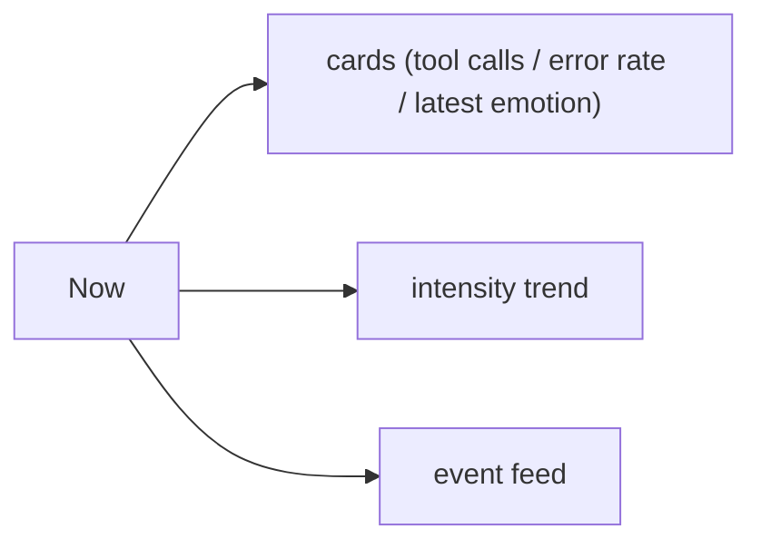
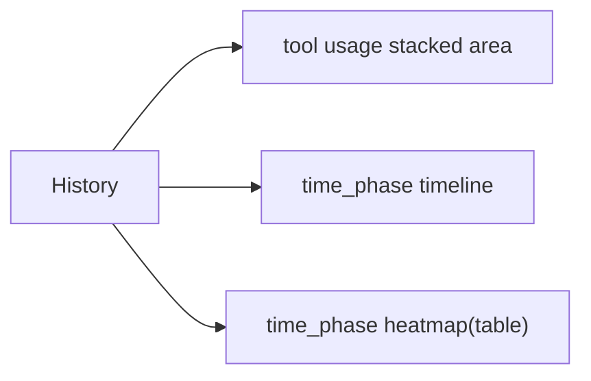
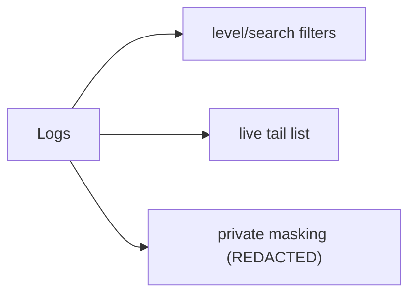

# Getting Started

- 更新責任者: ego-mcp dashboard maintainers

## 開発者向け

### ローカル起動（backend 単体 / in-memory）

```bash
cd dashboard
uv sync --group dev
uv run uvicorn ego_dashboard.__main__:app --reload
```

別ターミナルで frontend:

```bash
cd dashboard/frontend
npm ci
npm run dev
```

### docker-compose 起動（推奨）

```bash
cd dashboard
cp .env.example .env
docker compose up --build
```

起動先:
- frontend: `http://localhost:4173`
- backend API: `http://localhost:8000`

### 動作確認チェックリスト

- `Now` タブが初期表示される
- `History` タブに tool usage / string 可視化が表示される
- `Logs` タブで level / search フィルタが動作する

## 運用者向け

### 初回導入時の最小手順

1. `.env` を作成して DB/Redis/ログパスを設定する
2. `ego-mcp` の `EGO_MCP_LOG_DIR`（既定 `/tmp`）配下に `ego-mcp-YYYY-MM-DD.log` が出力されることを確認する
3. `.env` の `DASHBOARD_LOG_MOUNT_SOURCE` / `DASHBOARD_LOG_PATH` を必要に応じて合わせる
4. `docker compose up -d` を実行する
5. `docker compose logs -f ingestor` で取り込みログを確認する

### 画面簡易図（Now / History / Logs）






