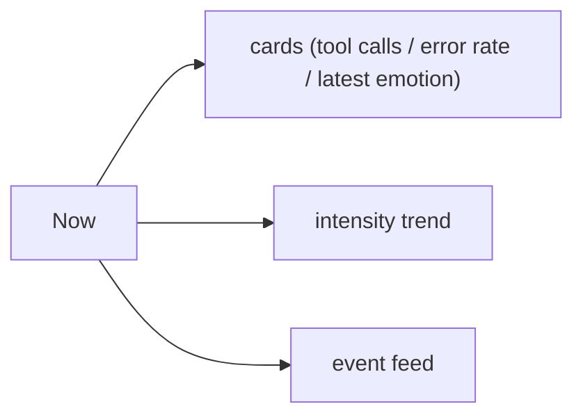
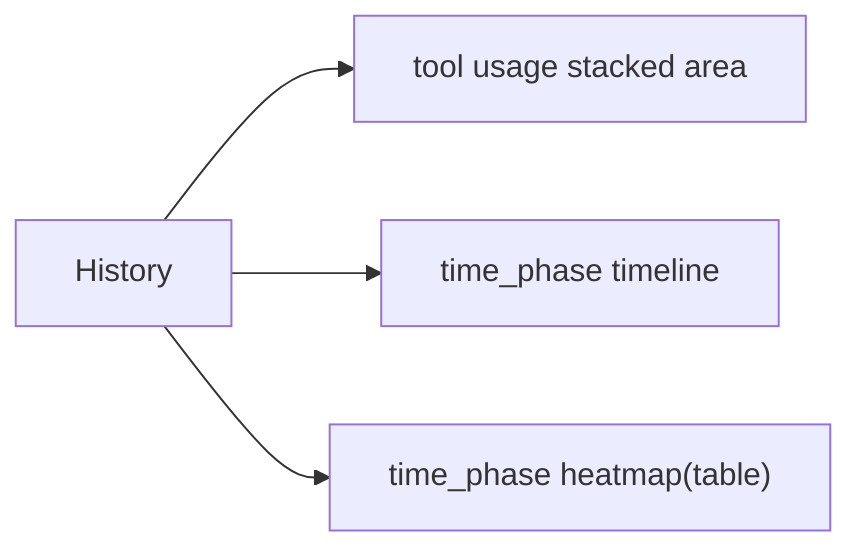
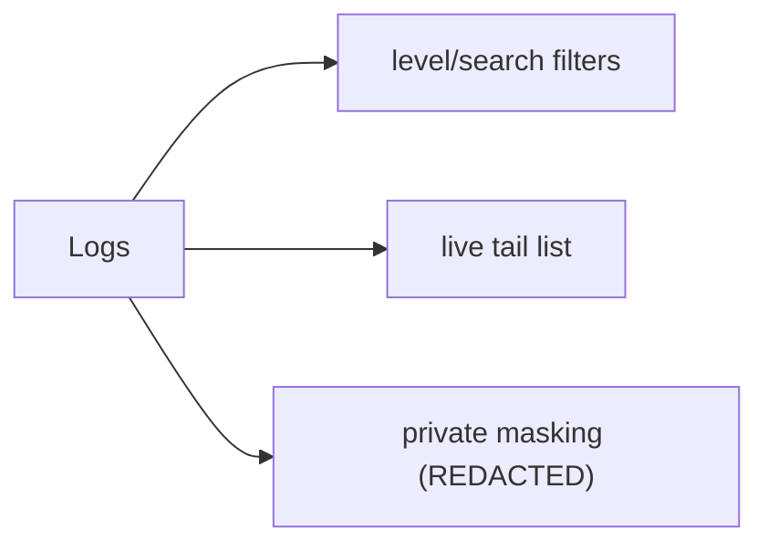

# Getting Started

- Maintainer: ego-mcp dashboard maintainers

## For Developers

### Local Startup (Backend Only / In Memory)

```bash
cd dashboard
uv sync --group dev
uv run uvicorn ego_dashboard.__main__:app --reload
```

In a separate terminal, start the frontend:

```bash
cd dashboard/frontend
npm ci
npm run dev
```

### Docker Compose Startup (Recommended)

```bash
cd dashboard
cp .env.example .env
# To enable Memory Network / Notions in compose,
# set DASHBOARD_EGO_MCP_DATA_DIR to the ego-mcp data dir
docker compose up --build
```

Endpoints:
- frontend: `http://localhost:4173`
- backend API: `http://localhost:8000`
- The fixed desire catalog is loaded from `${DASHBOARD_EGO_MCP_DATA_DIR}/settings/desires.json`, so if you use an ego-mcp data dir, pass that same absolute path to the backend
- Checking that `GET /api/v1/desires/catalog` returns `status=ok` is the easiest way to confirm fixed desire sync is working

### Quick Verification Checklist

- The `Now` tab is shown by default
- The `History` tab shows tool usage and string visualizations
- The `Logs` tab responds to level and search filters

## For Operators

### Minimum First-Time Setup

1. Create `.env` and set the DB, Redis, and log path values
2. If you use Memory Network / Notions, set `.env` `DASHBOARD_EGO_MCP_DATA_DIR` to the absolute ego-mcp data dir
3. If you want fixed desire catalog rendering, use the same `DASHBOARD_EGO_MCP_DATA_DIR` and confirm `${DASHBOARD_EGO_MCP_DATA_DIR}/settings/desires.json` exists
4. Confirm `curl http://localhost:8000/api/v1/desires/catalog` returns `status=ok` and `fixed_desires`
5. Confirm `ego-mcp` writes `ego-mcp-YYYY-MM-DD.log` under `EGO_MCP_LOG_DIR` (default: `/tmp`)
6. Align `.env` `DASHBOARD_LOG_MOUNT_SOURCE` / `DASHBOARD_LOG_PATH` as needed
7. Run `docker compose up -d`
8. Check ingestion logs with `docker compose logs -f ingestor`

### Simple Screen Map (Now / History / Logs)


```mermaid
flowchart LR
  A["Now"] --> A1["cards (tool calls / error rate / latest emotion)"]
  A --> A2["intensity trend"]
  A --> A3["event feed"]
```


```mermaid
flowchart LR
  B["History"] --> B1["tool usage stacked area"]
  B --> B2["time_phase timeline"]
  B --> B3["time_phase heatmap(table)"]
```


```mermaid
flowchart LR
  C["Logs"] --> C1["level/search filters"]
  C --> C2["live tail list"]
  C --> C3["private masking (REDACTED)"]
```
